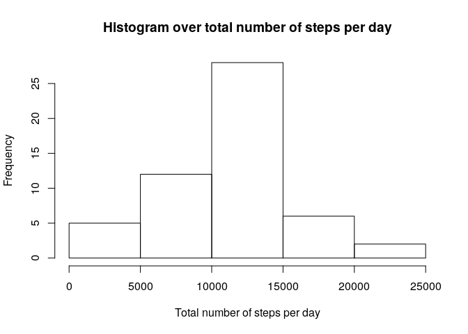
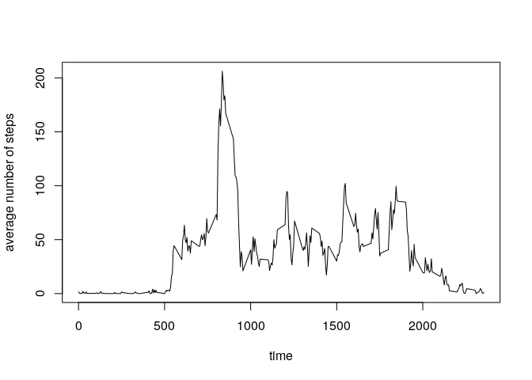
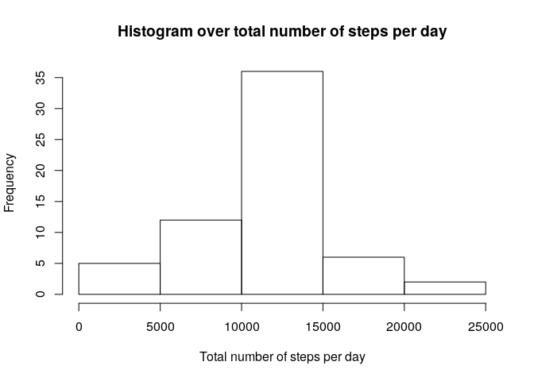
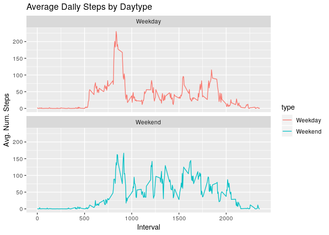

First load the libraries.


```r
library(Hmisc)
library(knitr)
library(dplyr)
library(ggplot2)
```

## Loading and preprocessing the data
First load the csv-file activity.csv and view its head.


```r
rawcsv<-read.csv(file="activity.csv",header=TRUE,sep=",")
head(rawcsv)
```

```
##   steps       date interval
## 1    NA 2012-10-01        0
## 2    NA 2012-10-01        5
## 3    NA 2012-10-01       10
## 4    NA 2012-10-01       15
## 5    NA 2012-10-01       20
## 6    NA 2012-10-01       25
```

As can be seen below, there are some NA values, so remove rows containing NA.


```r
tidycsv<-na.omit(rawcsv)
head(tidycsv)
```

```
##     steps       date interval
## 289     0 2012-10-02        0
## 290     0 2012-10-02        5
## 291     0 2012-10-02       10
## 292     0 2012-10-02       15
## 293     0 2012-10-02       20
## 294     0 2012-10-02       25
```

## What is mean total number of steps taken per day?
Ignoring the missing values for days, we just sum the number of steps for each day.


```r
by_day<-group_by(tidycsv,date)
total_steps_per_day<-summarise(by_day,total_steps=sum(steps))
total_steps_per_day
```

```
## # A tibble: 53 x 2
##    date       total_steps
##    <fct>            <int>
##  1 2012-10-02         126
##  2 2012-10-03       11352
##  3 2012-10-04       12116
##  4 2012-10-05       13294
##  5 2012-10-06       15420
##  6 2012-10-07       11015
##  7 2012-10-09       12811
##  8 2012-10-10        9900
##  9 2012-10-11       10304
## 10 2012-10-12       17382
## # … with 43 more rows
```


```r
hist(total_steps_per_day$total_steps, main="Histogram over total number of steps per day",xlab="Total number of steps per day")
```

<!-- -->


```r
s<-summary(total_steps_per_day$total_steps)
```

The median number of total number od steps per day is: 10765.

The mean total number of steps per day is: 10766.

## What is the average daily activity pattern?


```r
by_time<-group_by(tidycsv,interval)
average_num_steps_at_time<-summarise(by_time,average_num_steps=mean(steps))
average_num_steps_at_time
```

```
## # A tibble: 288 x 2
##    interval average_num_steps
##       <int>             <dbl>
##  1        0            1.72  
##  2        5            0.340 
##  3       10            0.132 
##  4       15            0.151 
##  5       20            0.0755
##  6       25            2.09  
##  7       30            0.528 
##  8       35            0.868 
##  9       40            0     
## 10       45            1.47  
## # … with 278 more rows
```

To plot the daily activity, we do


```r
plot(average_num_steps_at_time$interval,average_num_steps_at_time$average_num_steps,type="l",ylab="average number of steps",xlab="time")
```

<!-- -->

and to get the peak value from the above time series, we do


```r
s<-average_num_steps_at_time[which.max(average_num_steps_at_time$average_num_steps),]
```

yielding the peak value 206.1698113 at the interval 835.

## Imputing missing values

To impute the missing values, one can for example fill in averaegs where there are NA. So, let us proceed with that idea, but first, let's see how many values are missing,


```r
imputedcsv<-rawcsv
missing_rows=which(is.na(imputedcsv)[,1])
length(missing_rows)
```

```
## [1] 2304
```

and to impute, we use the readily made impute function


```r
for(n in missing_rows){
  imputedcsv[n,1]<-average_num_steps_at_time[which(average_num_steps_at_time[,1]==imputedcsv[n,3]),2]
}
head(imputedcsv)
```

```
##       steps       date interval
## 1 1.7169811 2012-10-01        0
## 2 0.3396226 2012-10-01        5
## 3 0.1320755 2012-10-01       10
## 4 0.1509434 2012-10-01       15
## 5 0.0754717 2012-10-01       20
## 6 2.0943396 2012-10-01       25
```

which seems to be in order when compared with average_num_steps_at_time above. To see, if imputing made any duifference, let us for comparision plot a histogram


```r
by_day<-group_by(imputedcsv,date)
total_steps_per_day<-summarise(by_day,total_steps=sum(steps))
hist(total_steps_per_day$total_steps, main="Histogram over total number of steps per day",xlab="Total number of steps per day")
```

<!-- -->

which shows that by imputing with averages the histogram got reshaped with more values in the center. Next calculating the mean and median, we get


```r
s<-summary(total_steps_per_day$total_steps)
```

The median number of total number od steps per day is: 10766.

The mean total number of steps per day is: 10766.

And as can be seen, the changes in mean and median by imputing data were quite small.

## Are there differences in activity patterns between weekdays and weekends?

First, create a function day_type to see if we have weekday or weekend for a given date and then add a new column


```r
day_type<-weekdays(as.Date(imputedcsv$date))
day_type[which(day_type=="Saturday")]<-"Weekend"
day_type[which(day_type=="Sunday")]<-"Weekend"
day_type[which(day_type!="Weekend")]<-"Weekday"
imputedcsv["type"]<-as.factor(day_type)
```

Next group by interval and day type to perform a ggplot.


```r
by_time<-group_by(imputedcsv,interval,type)
average_num_steps_at_time<-summarise(by_time,average_num_steps=mean(steps))
ggplot(average_num_steps_at_time,aes(x=interval,y=average_num_steps,color=type))+geom_line(linetype="solid")+labs(title="Average Daily Steps by Daytype",x="Interval",y="Avg. Num. Steps")+facet_wrap(~`type`,ncol=1)
```

<!-- -->
